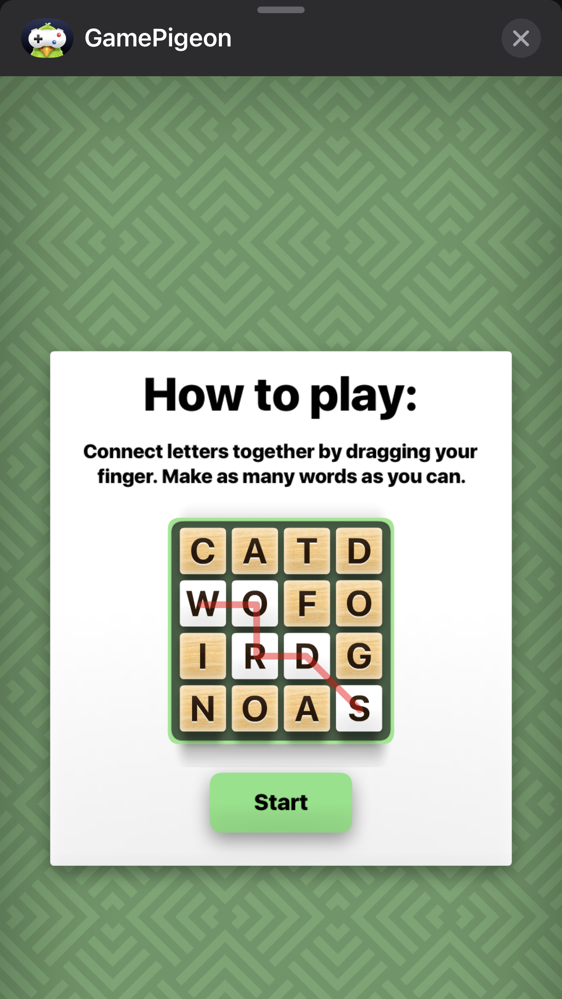
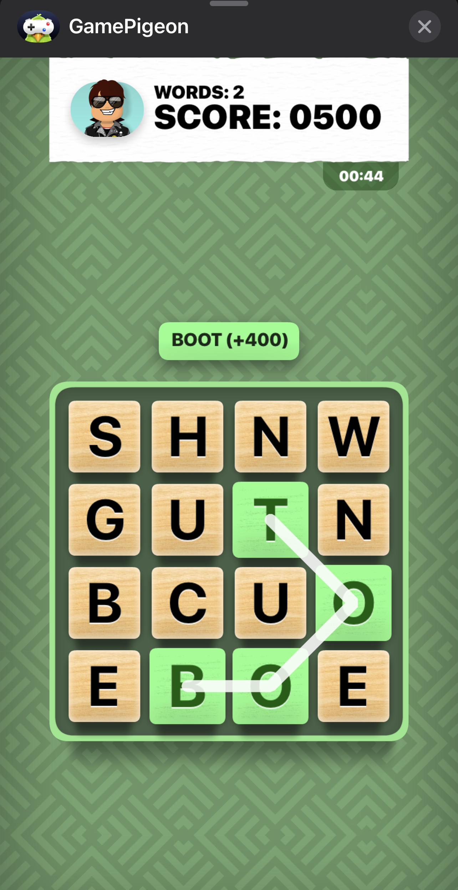
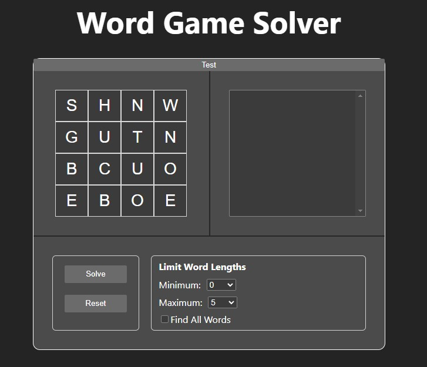

# Word Game Solver (wgs)

A hobby project for learning React and Typescript

The project is a React Typescript tool for finding solutions to the word game puzzle "Word Hunt" in the IOS mobile app [GamePigeon](http://gamepigeonapp.com/)

## The Game

The game is available on IOS and is played through iMessages.

### The rules

### Example board

## The Solving Tool

1. Run `npm run dev`
2. Go to `http://localhost:5173/`
3. Enter the letters of your game into the board on the top left panel
4. Press "Solve"
5. The tool will work for a while and then show all possible valid words in the top right list box
6. Clicking on a solution will highlight the letters on the board

## Logic

The tool works as follows:

1. Generate all possible valid x / y points on the board within the min / max length constraints
2. Get the string of letters associated with each valid x / y point combination
3. For each valid string, check if it is also a valid word in the [wordlist](./src/utils/wordlist.json)
4. Display the solutions in order of length and then alpha
5. Highlight the words associated x / y points on the board when a solution is clicked
